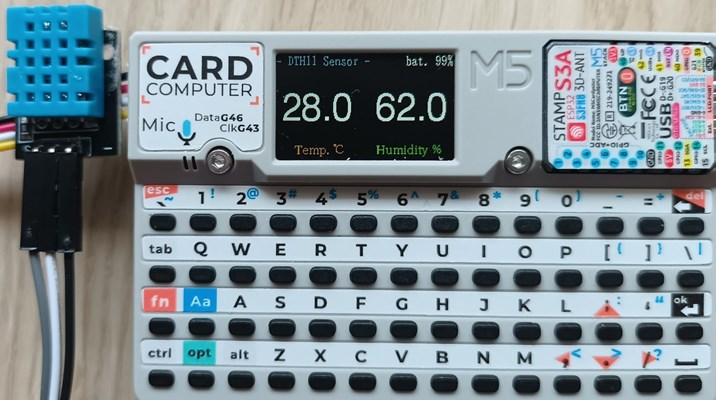

# dth11-cardputer
**[日本語](README_jp.md)**

This is software for using the DHT11 sensor (temperature and humidity sensor) with the M5Stack Cardputer.
It measures the ambient temperature and humidity and displays them on the Cardputer's screen.

 

## Main Features

- **Temperature and Humidity Display**: Displays real-time temperature and humidity from the DHT11 sensor.
- **Battery Level Display**: Shows the current battery level as a percentage.
- **Multi-language Support**: Switchable display language between English and Japanese.
- **Customizable Settings**:
    *   Adjust screen brightness
    *   Set the low battery warning threshold
    *   Switch the display language
- **Persistent Settings**: Settings are automatically saved to the Cardputer's internal non-volatile memory (NVS) and are retained on the next startup.
- **Power Saving Design**: Reduces battery consumption by disabling Wi-Fi and Bluetooth and optimizing the CPU frequency.
- **Battery Protection**: Automatically shuts down when the battery level falls below the set threshold.
- **SD Updater Support**: Allows launching another application (`/menu.bin`) from the SD card by pressing a specific key at startup.

## Requirements

### Hardware
- M5Stack Cardputer
- DHT11 sensor module (GROVE compatible)
- Connection cables (e.g., jumper wires)

### Software
- Visual Studio Code
- PlatformIO IDE extension

## Installation and Build

1.  Clone or download this repository.
2.  Open the cloned folder in Visual Studio Code.
3.  Connect the Cardputer to your PC.
4.  Click the "Upload" button in PlatformIO to flash the firmware.

Required libraries are listed in `platformio.ini` and will be installed automatically during the build process.

## Usage

### Sensor Connection
Connect the DHT11 sensor to the Cardputer's GROVE port (Port.A).

| Cardputer (Grove) | DTH11 | Notes                              |
| :---------------- | :---- | :--------------------------------- |
| G1 (GPIO 1)       | DATA  |                                    |
| G2 (GPIO 2)       | -     | (*)                                |
| 5V                | VCC   | Power                              |
| GND               | GND   | Ground                             |

(*) If you want to use DATA on GPIO2, please change the port setting in the source code.

### Basic Operation
When you turn on the power, it will automatically start measuring and displaying the temperature and humidity.

### Settings Mode

Press a key on the keyboard to change various settings. The settings are displayed on the second line at the top of the screen.

| Key | Function                                   |
| :-- | :----------------------------------------- |
| `1` | Enter **Screen Brightness** setting mode   |
| `2` | Enter **Low Battery Threshold** setting mode |
| `3` | Enter **Language** setting mode            |
| `` ` `` | Exit settings mode and clear the display   |

### Changing Settings

Use the following arrow keys to change the values in each setting mode.

| Key | Cardputer Key | Function                       |
| :-- | :------------ | :----------------------------- |
| ↑   | `;`           | Increase value (large step)    |
| ↓   | `.`           | Decrease value (large step)    |
| →   | `/`           | Increase value (small step)    |
| ←   | `,`           | Decrease value (small step)    |

*   In **Language settings**, pressing any arrow key will switch the language.
*   Changed settings are saved automatically.

### Launching the SD Updater

Press and hold the `a` key during the Cardputer's startup to launch `menu.bin` from the root of the SD card.

## License

This project is licensed under the MIT License.

## Author

NoRi

