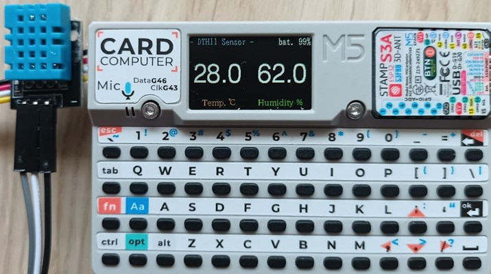

# dth11-cardputer
**[`　English　`](README.md)**

M5Stack CardputerでDHT11センサー（温湿度センサー）を使用するためのソフトウェアです。
周囲の温度と湿度を測定し、Cardputerのディスプレイに表示します。

 

## 主な機能

- **温湿度表示**: DHT11センサーから取得した温度と湿度をリアルタイムで表示します。
- **バッテリー残量表示**: 現在のバッテリー残量をパーセンテージで表示します。

- **多言語対応**: 表示言語を英語と日本語で切り替え可能です。
- **カスタマイズ可能な設定**:
    *   画面の明るさ調整
    *   低バッテリー警告のしきい値設定
    *   表示言語の切り替え
- **設定の永続化**: 設定内容はCardputer内部の不揮発性メモリ（NVS）に自動で保存され、次回起動時も維持されます。
- **省電力設計**: Wi-FiとBluetoothを無効にし、CPU周波数を最適化することで、バッテリー消費を抑えます。
- **バッテリー保護**: バッテリー残量が設定したしきい値を下回ると、自動的にシャットダウンします。
- **SDアップデーター対応**: 起動時に特定のキーを押すことで、SDカードから別のアプリケーション（`/menu.bin`）を起動できます。

## 必要なもの

### ハードウェア
- M5Stack Cardputer
- DHT11センサーモジュール（GROVE互換）
- 接続用ケーブル（ジャンパーワイヤーなど）

### ソフトウェア
- [Visual Studio Code](https://code.visualstudio.com/)
- [PlatformIO IDE 拡張機能](https://platformio.org/platformio-ide)

## インストールとビルド

1. このリポジトリをクローンまたはダウンロードします。
2. Visual Studio Codeでクローンしたフォルダを開きます。
3. CardputerをPCに接続します。
4. PlatformIOの「Upload」ボタンをクリックしてファームウェアを書き込みます。

必要なライブラリは`platformio.ini`に記述されており、ビルド時に自動でインストールされます。

## 使い方

### センサーの接続
DHT11センサーをCardputerのGROVEポート（Port.A）に接続します。

| Cardputer (Grove) | DTH11 | 備考                               |
| :---------------- | :------ | :--------------------------------- |
| G1 (GPIO 1)       | DATA    |                                    |
| G2 (GPIO 2)       | - 　    | （※）                              |
| 5V                | VCC     | 電源                               |
| GND               | GND     | グランド                           |

（※） DATAをGPIO2で使用したい場合は、ソースのポート設定を変更してください。

### 基本操作
電源を入れると、自動的に温湿度の測定と表示が開始されます。

### 設定モード

キーボードのキーを押すことで、各種設定を変更できます。設定内容は画面上部の2行目に表示されます。

| キー | 機能                               |
| :--- | :--------------------------------- |
| `1`  | **画面の明るさ** の設定モードに移行 |
| `2`  | **低バッテリーしきい値** の設定モードに移行 |
| `3`  | **言語** の設定モードに移行        |
| `` ` ``  | 設定モードを終了し、表示をクリア   |

### 設定値の変更

各設定モードで、以下の矢印キーを使って値を変更します。

| キー | Cardputerキー | 機能             |
| :--- | :------------ | :--------------- |
| ↑    | `;`           | 値を大きく増加   |
| ↓    | `.`           | 値を大きく減少   |
| →    | `/`           | 値を小さく増加   |
| ←    | `,`           | 値を小さく減少   |

*   **言語設定**では、どの矢印キーを押しても言語が切り替わります。
*   変更した設定値は自動的に保存されます。

### SDアップデーターの起動

Cardputerの起動中にキーボードの `a` キーを押し続けると、SDカードのルートにある `menu.bin` を起動します。

## ライセンス

このプロジェクトは MIT License の下で公開されています。

## 作者

NoRi

